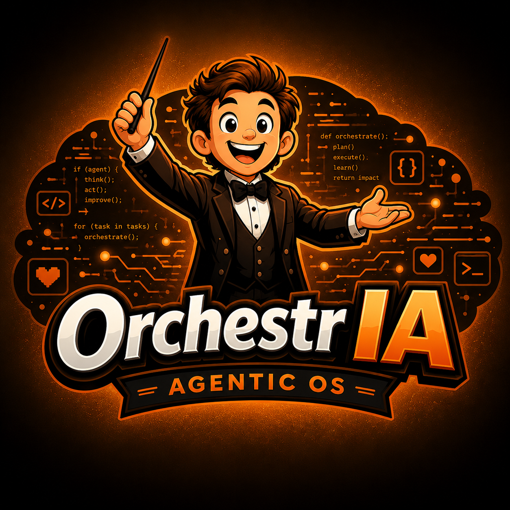

<div align="center">

<!-- Add your logo at docs/logo.png (the orange/black "OrchestrIA" mark) -->


# OrchestrIA — Agentic OS

**A local-first platform to orchestrate, supervise and persist Claude agents — on your own machine.**

[](LICENSE)
[](https://nextjs.org)
[](https://nodejs.org)

</div>

---

OrchestrIA is a conductor for AI agents that runs entirely on your own
machine. It spawns [Claude](https://claude.com) instances as long-lived,
configurable agents, coordinates them across channels (Telegram, webhooks),
schedules recurring missions, gives every agent scoped memory, and renders the
whole thing as a live web dashboard.

**Nothing leaves your machine.** State lives in a single SQLite file you own —
no cloud database, no external sync, no telemetry. And there is no hosted API
or Anthropic SDK: OrchestrIA drives the official `claude` CLI over a
pseudo-terminal, so model access and billing stay inside your existing Claude
CLI session — no extra API key, no second bill.

## Why

Running a single coding agent is easy. Running *several* — each with its own
role, tools, memory and triggers, and being able to *see* what they're all
doing — is not. OrchestrIA is the missing control plane: agents become
first-class objects you can create, wire together, schedule, and observe.

## In practice — a daily briefing in 10 minutes

A common first build: have an agent message you a briefing every morning on
Telegram. End to end, with OrchestrIA's own primitives — no n8n, no external
scheduler, no glue code.

**1. Wire a Telegram channel.** Copy the template and drop in a BotFather token:

```bash
cp .orchestria/channels/telegram.json.example .orchestria/channels/telegram.json
```

```json
{ "type": "telegram", "default_agent": "_main", "allowed_chat_ids": [], "bot_token": "<your-botfather-token>" }
```

**2. Schedule a routine.** A cron-style mission that runs an agent and pushes
the result to the channel. Create it from the `/routines` dashboard, or via the
API:

```bash
curl -X POST localhost:8000/api/routines -H 'content-type: application/json' -d '{
  "id": "morning-brief",
  "name": "Morning briefing",
  "cron_expr": "0 8 * * *",
  "agent_id": "_main",
  "prompt": "Summarise yesterday: key signals, what needs my attention, one concrete suggested action. Be concise.",
  "notify_on": "always",
  "notify_channel": "telegram"
}'
```

Every day at 08:00 the `_main` agent runs the prompt as a **tracked mission** —
cost, tokens, duration and a full event log recorded — and Telegram pings you
with the result. Swap the prompt, point it at your own agent, or fan out to
several routines. Same pattern scales from a personal digest to a fleet of
scheduled agents you can watch on the dashboard.

**Fleet digest.** Drop `{{FLEET_STATS}}` (or `{{FLEET_STATS:30}}` for a
30-day window) anywhere in a routine prompt and the scheduler expands it, at
fire time, into a real activity summary from your mission history — spend,
volume and failures per agent. Schedule it weekly and an agent turns those
numbers into a "what your fleet did, what to look at" digest in Telegram.
The stats never leave your machine; they come straight from the local DB.

## Features

- **Agent mesh** — define agents as folders (`config.json` + system prompt),
  connect sub-agents to an orchestrator, visualize the live graph.
- **Missions & runs** — every agent invocation is a tracked mission with cost,
  token usage, duration and a full event log.
- **Channels** — talk to agents from Telegram or inbound webhooks; route by
  `@agent` tag.
- **Routines** — cron-style scheduled missions with completion notifications.
  No system `crontab`/`launchd` needed.
- **Scoped memory** — per-agent notes with `NONE` / `SESSION` / `USER` /
  `GLOBAL` scopes, auto-injected into the system prompt. Opt-in
  **distillation** turns rolled-over transcript into a compact `learnings.md`,
  so an agent gets *sharper* with use instead of just accumulating logs.
- **Skills** — reusable, filesystem-defined tools attachable to agents.
- **Remote access** — issue scoped, expiring tokens for external agents, with
  rate limiting and an audit log.
- **Dashboards** — cost trends, per-agent analytics, a Kanban board, and a
  real-time console.
- **Local-first** — one SQLite database, no cloud dependency, your data on
  your disk.

## Requirements

- **Node.js ≥ 20**
- **The `claude` CLI** installed and on your `PATH`, authenticated once via
  `claude login`. ([Claude Code](https://claude.com/claude-code))
- macOS or Linux (Windows via WSL — `node-pty` + `better-sqlite3` are native).

## Quick start

```bash
git clone <your-fork-url> orchestria
cd orchestria
npm install

# One-time: authenticate the Claude CLI OrchestrIA will drive
claude login

# (optional) tweak runtime config
cp .env.example .env.local

npm run dev
```

Open <http://localhost:8000>. The default `_main` orchestrator agent and a
minimal `pinger` sub-agent ship ready to use.

> Production build: `npm run build && npm run start`.

## Configuration

Everything is optional — OrchestrIA boots with working defaults.

| Env var | Default | Purpose |
|---|---|---|
| `ORCHESTRIA_SQLITE` | `.orchestria/orchestria.db` | Override the database path |
| `ORCHESTRIA_CHANNELS_AUTOSTART` | on | Start channel listeners at boot |
| `ORCHESTRIA_ROUTINES_AUTOSTART` | on | Start the routine scheduler |
| `ORCHESTRIA_MEMORY_AUTORECORD` | on | Record mission outputs into memory |
| `ORCHESTRIA_MEMORY_DISTILL` | off | Distill rolled-over memory into `learnings.md` (opt-in; uses tokens) |
| `ORCHESTRIA_MAX_CONCURRENT` | `8` | Max agents running at once |
| `ORCHESTRIA_MISSION_TIMEOUT_MS` | `1800000` | Per-mission wall-clock kill (ms) |

See [`.env.example`](.env.example).

### Defining an agent

Create `.orchestria/agents/<id>/config.json`:

```json
{
  "id": "researcher",
  "name": "Researcher",
  "model": "claude-sonnet-4-6",
  "permissionMode": "auto",
  "allowedTools": ["Read", "WebSearch", "WebFetch"],
  "memoryScope": "USER",
  "parent": "_main"
}
```

Add an optional `.orchestria/agents/researcher/system-prompt.md`. It appears in
the UI immediately — discovery is filesystem-driven, no code changes.

### Configuring a channel

Channel credentials are **git-ignored**. Copy the template and fill it in:

```bash
cp .orchestria/channels/telegram.json.example .orchestria/channels/telegram.json
# then add your BotFather token
```

## Project structure

```
src/
  app/                Next.js App Router pages + /api route handlers
  lib/
    orchestrator/     agent spawning (drives the `claude` CLI via node-pty)
    channels/         Telegram + webhook inbound, @agent routing
    routines/         cron-style scheduler
    remote/           scoped token issuing / auth / audit
    db.ts             SQLite (better-sqlite3, WAL)
  components/         UI (visualizer, topbar, …)
.orchestria/          user-space runtime: agent / skill / channel configs
                      (databases, logs, memory, secrets are git-ignored)
```

## Security

OrchestrIA stores agent configs in `.orchestria/`. **Channel credentials,
databases, logs, memory and `*.bak` files are git-ignored by design** — only
`*.json.example` channel templates are tracked. Never commit a real bot token,
password, API key, third-party/client data, or a database snapshot. Authenticate
the Claude CLI separately (`claude login`); OrchestrIA never reads your key.

If you find a security issue, please open a private report rather than a public
issue.

## Contributing

Issues and PRs are welcome. This is an early-stage project (v0.x) — APIs and
schema may change. Before touching framework code, note this repo runs
**Next.js 16** (breaking changes vs older majors); see [`CLAUDE.md`](CLAUDE.md).

## License

[MIT](LICENSE) © 2026 Florian Dupuis
